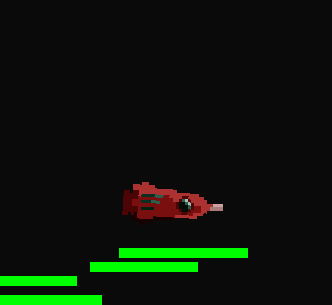
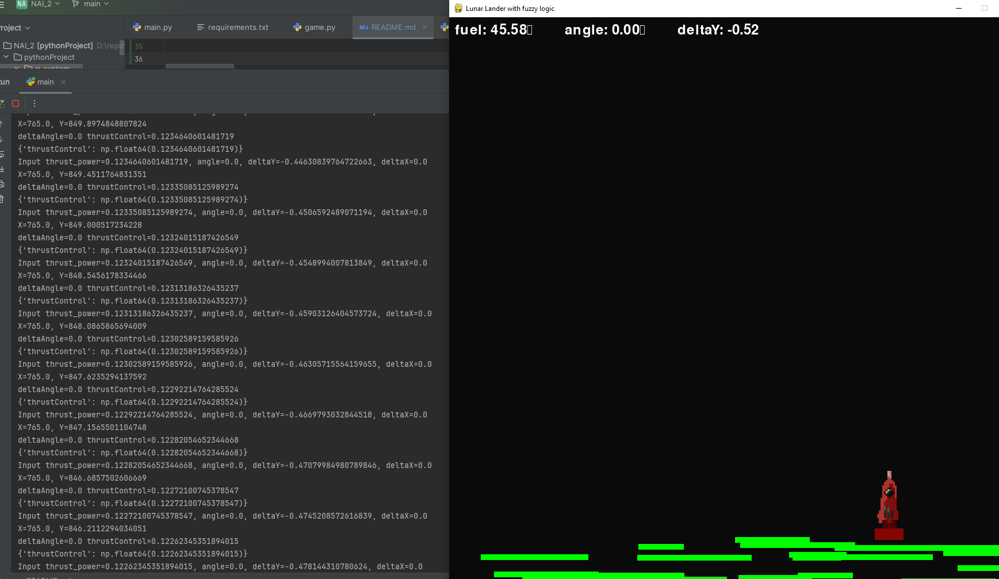

# NAI_2
Fuzzy Logic AI system for Moon Lander

## Opis problemu
Zastosowanie systemu eksperckiego opartego na logice rozmytej do lądowania statku kosmicznego, dokładnie do wygrywnaia w grę typu Moonlander.

Zasady gry:
1. Statek musi podejść do lądowania z odpowiednio niską prędkością.
2. Statek musi lądować w kącie zbliżonym do kąta prostopadłego do podłoża, czubkiem do góry.

## Zastosowane parametry

### Wejście:
- wysokość nad gruntem (posY)
- prędkość w osi pionowej (velocityY)
- kąt nachylenia rakiety względem podłoża (angle)

### Wyjście
- siła napędu
- regulacja kątu podejścia rakiety

## Zasady zastosowane we (względnie) wygrywającym systemu kontrolnym
1. Jeśli masz nieprawidłowy kąt natarcia - skoryguj go odpowiednio w prawo lub w lewo.
2. Jeśli masz optymalny kąt natarcia:
   - oraz jesteś na średniej wysokości to średnio zwiększ napęd.
   - oraz jesteś na niskiej wysokości - mocno zwiększ napęd.
   - oraz prędkość upadku jest zbyt wysoka - nieznacznie zwiększ napęd.
3. Jeśli predkość jest zbyt niska - zbliżasz się do "zatrzymania" w miejscu lub zacznyasz wznosić - zmniejsz napęd.*
4. Jeśli lecisz do góry - wyłącz silnik!*

*- Trudną częścią zadania optymalizacyjnego było takie dobranie parametrów zmniejszania siły napędu lub wyłączania go całkowicie żeby zapobiec próbom "unoszenia się" nad ziemią lądownika, spowodowanym zasadą unikania ryzyka zderzenia z gruntem poprzez zwiększanie prędkości bliżej ziemi. Pomogło dopiero zwiększenie zakresów ujemnych wartości przy dodaniu zapisanej na sztywno zasady, że jeśli wartość z systemu kontrolnego dla napędu jest ujemna to zatrzymuje się na minimalnej wartości - zero (w rakiecie brak silników wstecznych).

